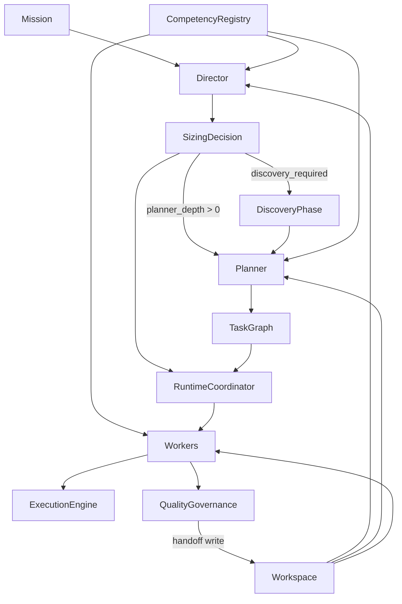

# Архитектура MorphEnterprise v2

## Центральная диаграмма



**TaskGraph** — часть Workspace (не отдельный источник правды). Создаётся Planner'ом, обновляется RuntimeCoordinator'ом.

---

## Базовые объекты

### 1. Mission

| | |
|---|---|
| **Назначение** | Цель работы с критериями и ограничениями |
| **Входы** | Формулировка от пользователя или родительской mission |
| **Выходы** | Привязка к Workspace, risk_tier floor |
| **Ключевые поля** | goal, success_criteria, constraints, budget, risk_tier |

Mission может иметь **sub-missions** (ветки task graph). Один **Workspace на mission**.

### 2. Director

| | |
|---|---|
| **Назначение** | Triage и sizing — «сколько организации нужно» |
| **Входы** | Mission, Workspace summary, Registry |
| **Выходы** | SizingDecision |
| **Ограничение** | Только sizing, **не исполнение** |

Director — запись в Registry (модель + политика). Bootstrap: rule-based fast path или человек (Phase 0).

### 3. SizingDecision

| | |
|---|---|
| **Назначение** | Параметрическая конфигурация организации |
| **Входы** | Результат анализа Director |
| **Выходы** | Параметры для Planner, RuntimeCoordinator, QC |
| **Ключевые поля** | executor_count, parallelism, planner_depth, discovery_required, qc_depth, model_assignments, human_gates, confidence, rationale |

Непрерывные параметры первичны; planner_depth и qc_depth — уровни глубины, не «размер компании».

### 4. Workspace

| | |
|---|---|
| **Назначение** | Единый источник правды о проекте |
| **Входы** | Handoff, решения, артефакты |
| **Выходы** | Context slices для ролей |
| **Ключевые поля** | mission, requirements, decisions, artifacts, task_graph, current_state, handoff_records, knowledge_links |

### 5. CompetencyRegistry

| | |
|---|---|
| **Назначение** | Каталог компетенций, моделей, инструментов, людей |
| **Входы** | Регистрация ресурсов |
| **Выходы** | Matching task_profile × model_profile |
| **ResourceType** | model \| tool \| human |

### 6. Planner

| | |
|---|---|
| **Назначение** | Декомпозиция: task graph, зависимости, назначения |
| **Активен при** | planner_depth > 0 |
| **Входы** | Mission, SizingDecision, Workspace slice, Registry |
| **Выходы** | Task graph в Workspace |
| **Ограничение** | Не знает CrewAI/LangGraph |

Director решает **сколько**; Planner — **как разложить**.

### 7. Worker

| | |
|---|---|
| **Назначение** | Временная рабочая единица |
| **Входы** | Задача, компетенции, model, context slice |
| **Выходы** | Артефакты → Handoff |
| **Жизненный цикл** | Создан → исполнение → QC → handoff → уничтожен |

### 8. RuntimeCoordinator

| | |
|---|---|
| **Назначение** | Ведение task graph **во время исполнения** |
| **Входы** | SizingDecision, task graph, состояние Worker'ов |
| **Выходы** | Запуск/остановка Worker'ов, resize, escalation triggers |
| **Отличие от Planner** | Planner планирует; RuntimeCoordinator исполняет план |

Заменяет «Организатор» из v1 §10 на runtime-уровне.

### 9. QualityGovernance

| | |
|---|---|
| **Назначение** | Контроль качества, бюджета, безопасности |
| **Входы** | risk_tier, qc_depth из SizingDecision |
| **Выходы** | approve / reject / escalate to human |
| **Роли** | critic, guardian, arbiter |

### 10. ExecutionEngine

| | |
|---|---|
| **Назначение** | Адаптер к CrewAI, LangGraph, custom |
| **Входы** | Инструкции от RuntimeCoordinator |
| **Выходы** | Вызовы LLM и tools |
| **Ограничение** | Тонкий слой, без бизнес-логики организации |

---

## Не объект: DiscoveryPhase

Опциональная **фаза lifecycle**. Включается `discovery_required: true` в SizingDecision. Результаты пишутся в Workspace (Knowledge, Requirements).

---

## Иерархия работ

```
Mission
  └── sub-mission (опционально)
        └── work unit
              └── task (лист task graph)
```

Director выполняет sizing **на уровне каждой work unit** при необходимости (например, при делегировании sub-mission).

---

## Организационные паттерны (метафоры)

Из v1 §8–9. **Не runtime-объекты**, а design patterns для Planner:

| Паттерн | Применение |
|---------|------------|
| **Матричная структура** | Постоянные компетенции в Registry + временные команды Worker'ов |
| **Agile** | Короткие циклы: plan → execute → check → adjust в lifecycle |
| **Team Topologies** | Planner может собрать stream-aligned, platform, enabling, complicated-subsystem команды как шаблоны назначений |

---

## Сквозной пример: спецификация Workspace

| Объект | Участие |
|--------|---------|
| Mission | goal: «Спецификация Workspace», risk_tier: medium |
| Director | SizingDecision: executor_count=2, planner_depth=1 |
| Planner | task graph: draft ADR → review → finalize |
| Workspace | Хранит ADR, decisions, slices |
| Registry | competency: api_design, system_design; models |
| Workers | writer + critic |
| RuntimeCoordinator | Запускает writer, после handoff — critic |
| QC | qc_depth=critic (medium risk) |
| ExecutionEngine | Вызов LLM для каждого Worker |

---

## Пример: Mission

```yaml
id: mission-001
goal: "Написать спецификацию Workspace на основе Концепция.md v1"
success_criteria:
  - "ADR согласован"
  - "Покрыты 4 слоя памяти"
  - "Есть пример context slice"
constraints:
  max_duration: "2 weeks"
  budget_tokens: 500000
risk_tier: medium  # floor
budget:
  max_cost_usd: 50
```
