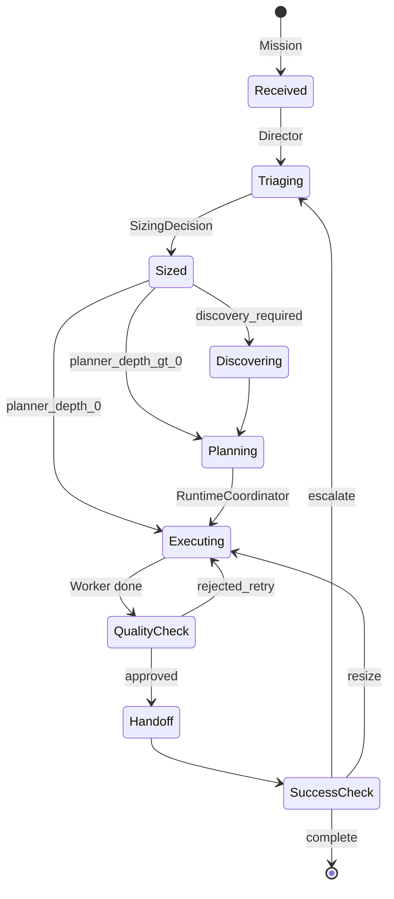

# Lifecycle

Главный цикл системы. Расширяет v1 §13 с Director, RuntimeCoordinator и escalation.

---

## Общая схема

```
Mission
  → Director (quick estimate)
  → SizingDecision
  → [DiscoveryPhase?]
  → [Planner?] → task_graph в Workspace
  → RuntimeCoordinator
  → Workers (через ExecutionEngine)
  → QualityGovernance (по risk / qc_depth)
  → Handoff → Workspace
  → Success check
  → Complete | Resize | Escalate
```



---

## Фазы

### 1. Receive

Mission поступает в систему. Создаётся или открывается Workspace. risk_tier floor берётся из mission.

### 2. Triage (Director)

- Quick estimate task_profile.
- Rule-based fast path для тривиальных задач.
- SizingDecision + confidence.
- При confidence < порога — strong Director review или human.

### 3. DiscoveryPhase (опционально)

При `discovery_required: true`:

- Исследование потребности, пользователя, конкурентов, рисков.
- Результаты → Workspace.requirements, Knowledge.
- Не пишет production-код.

### 4. Planning (опционально)

При `planner_depth > 0`:

- Planner строит task graph в Workspace.
- Назначения competency + model на задачи.
- planner_depth=0: RuntimeCoordinator создаёт implicit single-task graph из SizingDecision.

### 5. Execution

RuntimeCoordinator:

- выбирает готовые задачи по DAG;
- создаёт Worker'ов с context slice;
- вызывает ExecutionEngine;
- отслеживает бюджет и лимиты.

### 6. Quality

По qc_depth и risk_tier (см. [07-quality-governance.md](07-quality-governance.md)).

### 7. Handoff

Worker → Workspace.write(handoff_record). Обязателен (P8).

### 8. Success check

Сравнение с mission.success_criteria. Неудача → ветка resize/escalate.

---

## Escalation вверх

Триггеры:

- confidence Director ниже порога;
- QC reject N раз;
- бюджет исчерпан без прогресса;
- capability gap обнаружен mid-flight.

Действия (по возрастанию):

1. Сильнее модель на той же роли.
2. Увеличить executor_count или parallelism.
3. Увеличить planner_depth.
4. Включить discovery_required.
5. human gate.

---

## Resize во время работы

Инициирует **RuntimeCoordinator** при:

- фактический объём > оценки Director;
- task graph заблокирован;
- Worker исчерпал context slice.

Resize = новый SizingDecision (или patch) без полного restart mission. **Лимит реорганизаций** (например, 3) против thrashing.

---

## Bootstrap (Phase 0)

| Роль в концепции | Phase 0 |
|------------------|---------|
| Director | Человек |
| Planner | Человек + LLM |
| RuntimeCoordinator | Человек |
| Workspace | Markdown + git |
| Registry | docs/competencies.md |

Система не требует сама себя для первого шага.

---

## risk_tier

- Mission задаёт **floor**.
- Director оценивает фактический risk и может **только повысить**.
- Повышение влияет на qc_depth и human_gates.

---

## Сквозной пример: спецификация Workspace

| Фаза | Что происходит |
|------|----------------|
| Receive | mission-001 создана |
| Triage | Director → executor_count=2, planner_depth=1 |
| Planning | task graph: draft → review → finalize |
| Execution | writer → critic |
| Quality | critic approves draft |
| Handoff | ADR + decisions в Workspace |
| Success | success_criteria выполнены |
