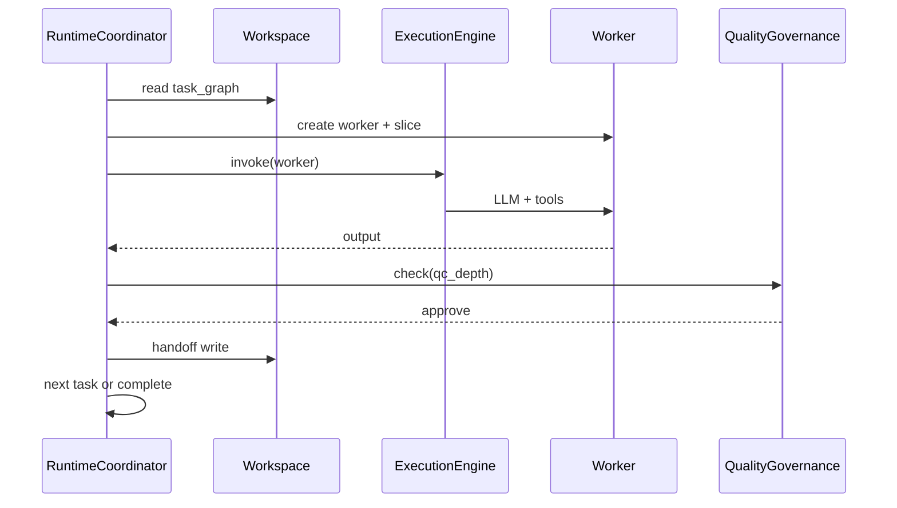

# Execution Layer

Исполнительный слой. Сохраняет идею v1 §10–11: ядро не привязано к CrewAI.

---

## Цепочка v1 → v2

**v1:**

```
Организатор → Workflow Engine → CrewAI/LangGraph → Агенты
```

**v2:**

```
Planner → RuntimeCoordinator → ExecutionEngine → Workers
```

| v1 | v2 | Функция |
|----|-----|---------|
| Организатор | RuntimeCoordinator | Runtime-координация |
| Workflow Engine | RuntimeCoordinator + task graph | Состояние DAG |
| CrewAI/LangGraph | ExecutionEngine | Вызов LLM/tools |
| Агенты | Workers | Временные единицы |

---

## RuntimeCoordinator

**Не путать с Planner.**

| | Planner | RuntimeCoordinator |
|---|---------|-------------------|
| Когда | До исполнения | Во время исполнения |
| Делает | Создаёт task graph | Ведёт task graph |
| Решает | Что делать | Кто сейчас делает, retry, resize |

### Обязанности RuntimeCoordinator

1. Читать task_graph из Workspace.
2. Выбирать задачи с выполненными зависимостями.
3. Создавать Worker с context slice и model из SizingDecision/Planner.
4. Вызывать ExecutionEngine.
5. Обрабатывать завершение → QC → handoff.
6. Триггерить resize при превышении объёма или блокировке.
7. Соблюдать parallelism из SizingDecision.
8. Останавливать при human_gate.

### Resize

RuntimeCoordinator запрашивает пересмотр SizingDecision (новый вызов Director или patch policy) при:

- work_units фактически > оценки;
- confidence Worker output низкий N раз;
- budget guard сработал.

---

## ExecutionEngine

Тонкий адаптер. **Не содержит:**

- логику sizing;
- выбор компетенций;
- handoff в Workspace (это RuntimeCoordinator + Worker protocol).

### Содержит

- интерфейс `invoke(worker_config) → result`;
- адаптеры: CrewAI, LangGraph, raw API;
- передачу tools из Registry.

### Planner не знает ExecutionEngine

Planner выдаёт абстрактные назначения (competency_id, model_id, task_id). RuntimeCoordinator маппит на конкретный адаптер.

---

## Динамический workflow (v1 §11)

Workflow = task graph в Workspace, созданный Planner'ом (или implicit при planner_depth=0).

**Не** писать заранее: `если X → A, B, C`.

**Валидация** динамического workflow:

- суммарный estimated_cost ≤ mission.budget;
- executor_count ≤ policy max;
- циклы в DAG запрещены;
- каждая задача имеет success_criteria.

---

## Диаграмма исполнения



---

## Сквозной пример: спецификация Workspace

1. RuntimeCoordinator видит task `draft-adr` ready.
2. Создаёт Worker writer, slice из Workspace.
3. ExecutionEngine → Sonnet → draft ADR.
4. QC: critic Worker через ExecutionEngine.
5. Handoff → Workspace.
6. Переход к task `finalize` или complete.
