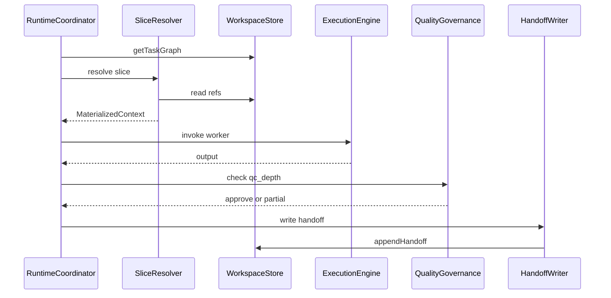

# ADR-001: Workspace spec

> **RU translation (reading):** [ru/ADR-001-workspace-spec.md](ru/ADR-001-workspace-spec.md)

**Status:** proposed  
**Date:** 2026-07-09

## Context

**Workspace** is the single source of truth for a mission (principle P2). Workers do not read the full Workspace; they receive a **context slice** (P3). Handoff is a mandatory write operation when a Worker completes (P8).

MorphEnterprise is a **standalone coordination system**. The **ExecutionEngine** (Cursor, raw API, CrewAI, LangGraph, etc.) is pluggable. Concept v2 describes *what* the Workspace contains and *how* memory layers relate; it does not define the **protocol** for storage, slice resolution, or handoff persistence.

This ADR specifies that protocol: logical model, workspace profiles derived from **SizingDecision**, and three backend-agnostic components — **WorkspaceStore**, **SliceResolver**, and **HandoffWriter**.

**Non-goals (deferred):**

- Storage technology (database, files, object store)
- Multi-tenant deployment and UI
- Normative mapping to this repository's Phase 0 dogfooding (see appendix)

## Decision

### 1. Logical Workspace model

Each **Mission** has exactly one Workspace. The task graph is a **field** of the Workspace, not a separate source of truth.

| Field | Description |
|-------|-------------|
| `mission` | Current mission and sub-missions |
| `requirements` | Requirements, including Discovery outputs |
| `decisions` | ADRs, choices, rationale |
| `artifacts` | Documents, schemas, code references |
| `task_graph` | Task DAG (part of Workspace) |
| `current_state` | Lifecycle phase status (enum values: ADR-004) |
| `handoff_records` | Append-only records from completed Workers |
| `knowledge_links` | References to external Knowledge |
| `competencies_active` | Competencies engaged in this mission |

Relations:

```
Mission 1──1 Workspace
Workspace 1──1 TaskGraph (field task_graph)
TaskGraph *──* Tasks
Task 1──* Workers (sequential in time)
```

### 2. Four memory layers (logical)

Memory layers are **tags/views** over Workspace content, not separate physical stores:

| Layer | Content | Typical source in Workspace |
|-------|---------|----------------------------|
| **Knowledge** | Shared docs, standards, research | `knowledge_links` (external blobs) |
| **CompetencyMemory** | Practices, past decisions, templates per competency | Registry (ADR-002) + handoff lessons |
| **ProjectMemory** | Why decisions were made, mission lessons | `decisions` + lesson records in handoffs |
| **WorkingContext** | Ephemeral active work for current Workers | Resolved into slices; durable parts move to ProjectMemory on handoff |

Slices include layers **selectively** — never all layers at once for a single Worker.

### 3. Workspace profiles (derived from SizingDecision)

Profiles describe the **effective shape** of a Workspace for a mission. They are **derived** from [SizingDecision](../concept/schemas/sizing-decision.yaml) fields — not from labels like solo/small/full. A normative `workspace_profile` field in the schema is deferred to ADR-003.

| Profile | Derivation rule | Required / active fields |
|---------|-----------------|--------------------------|
| **minimal** | `executor_count = 1` AND `planner_depth = 0` | `mission`, `current_state`, working context, `handoff_records` on completion; full `task_graph` optional (single task allowed) |
| **standard** | `planner_depth >= 1` OR (`executor_count > 1` AND `discovery_required = false`) | minimal fields + `task_graph`, `requirements`; `decisions` as needed |
| **full** | `discovery_required = true` OR `qc_depth = full` OR mission marked high-risk | All fields; full `task_graph`; Discovery in `requirements`; multiple `handoff_records` |

**Edge cases:**

| Case | Rule |
|------|------|
| `planner_depth = 0`, `executor_count > 1` | Treat as **minimal + parallelism**; `task_graph` optional |
| `discovery_required = true` | Profile → **full**; `requirements` writable |
| Handoff `status: failed` | Worker is complete with failure; mission may **resize** (P6) |
| Knowledge blobs | WorkspaceStore holds **refs only**; blobs live externally |

Director/SizingDecision selects the effective profile. **RuntimeCoordinator** must not expand a Worker's slice beyond policy without a resize (new SizingDecision or explicit `authorized_by: sizing_decision`).

Mapping to concept v2: **minimal** ≈ «минимальный Workspace»; **full** ≈ «полная организация»; **standard** is the intermediate case when planning or parallelism is required without full Discovery.

### 4. Protocol components

Three components define the Workspace protocol. Implementations may colocate them; the contracts remain distinct.

#### 4.1 WorkspaceStore

Backend-agnostic read/write API. No storage format is prescribed.

**Read:**

- `getMission(mission_id)`
- `getTaskGraph(mission_id)`
- `getState(mission_id)`
- `getHandoffs(mission_id, filters?)`
- `resolveRef(mission_id, ref)` — artifacts, knowledge links

**Write (by authorized role):**

| Operation | Authorized role | Notes |
|-----------|-----------------|-------|
| `putTaskGraph` | Planner | Creates/updates task DAG |
| `putRequirements` | Discovery, Planner | Requirements and Discovery outputs |
| `putState` | RuntimeCoordinator | Lifecycle updates; enum in ADR-004 |
| `appendHandoff` | HandoffWriter only | Append-only (P8); all Workers including Critic |
| `putFormalDecision` | Director | Formal ADRs outside Worker handoff (optional) |
| `setCompetenciesActive` | Director, RuntimeCoordinator | On sizing / resize |

Decisions, lessons, and artifacts from Workers enter primarily via handoff `records` (see [handoff-record.yaml](../concept/schemas/handoff-record.yaml)). Avoid duplicating the same decision through both handoff and `putFormalDecision`.

Knowledge blobs are **external**; the store persists references only.

#### 4.2 HandoffWriter

Facade over `WorkspaceStore.appendHandoff` — not a second append API.

1. Validate payload against [handoff-record.yaml](../concept/schemas/handoff-record.yaml) (min one record; types: decision, lesson, artifact).
2. Run **after QualityGovernance** — `status: completed` only when QC approves; `partial` or `failed` per schema when QC does not fully approve.
3. Attach `qc_result` when applicable.
4. Call `WorkspaceStore.appendHandoff`.
5. A Worker is **not complete** until handoff succeeds (P8).

#### 4.3 SliceResolver

Materializes a [WorkspaceContextSlice](../concept/schemas/workspace-slice.yaml) into an opaque **MaterializedContext** for the ExecutionEngine (text, JSON, or other — format not fixed here).

**Input:** `mission_id`, `task_id`, `worker_id`, `role` (worker | planner | director | critic | runtime_coordinator), `SizingDecision`, optional slice spec, `competency_ids`, **Registry read** for competency memory (ADR-002 dependency).

**Output:** `MaterializedContext` bounded by `max_tokens` when set.

**Rules:**

- Resolve `includes` / `excludes` per slice spec and role.
- Respect `authorized_by`: slice expansion only when `sizing_decision` or after explicit resize — RuntimeCoordinator cannot widen a Worker slice on its own (P3).
- Enforce role access matrix:

| Role | May read |
|------|----------|
| Worker | Slice for own competency + task |
| Planner | Mission summary + task graph + requirements |
| Director | Mission summary + risk + state (not full artifact bodies) |
| RuntimeCoordinator | Task graph + state; does not expand Worker slices without resize |
| Critic | Executor slice + output + success_criteria |

### 5. RuntimeCoordinator interaction

High-level sequence (detail in ADR-005):



**ExecutionEngine does not:** sizing, competency selection, handoff persistence, or direct Workspace writes.

**ADR boundaries:**

| Topic | ADR |
|-------|-----|
| Registry API, competency memory sources | ADR-002 |
| Director sizing algorithm | ADR-003 |
| `current_state` lifecycle enum | ADR-004 |
| RC state machine, retry, resize | ADR-005 |

### Appendix A — Phase 0 dogfooding (non-normative)

This repository uses MorphEnterprise principles in Phase 0 only. The mapping below **does not** define the target system.

| v2 object | This repo (Phase 0) |
|-----------|---------------------|
| Workspace | `docs/` + git |
| Director | Human |
| ExecutionEngine | Cursor |
| Handoff | `docs/JOURNAL.md` + git commits (informal) |
| WorkspaceStore / SliceResolver / HandoffWriter | Not implemented — manual process |

## Consequences

**Positive:**

- Implementation-agnostic; any language or stack in Phase 2+
- Memory-by-task formalized via profiles and slices
- Clear boundary between ExecutionEngine and Workspace protocol

**Negative / deferred:**

- No storage backend choice (separate implementation decision in Phase 2)
- SliceResolver complexity lands in Phase 2 code
- RU concept chapters 01–10 remain detailed source until full EN translation

**Follow-up:**

- ADR-002 — CompetencyRegistry spec
- ADR-003 — Director / SizingDecision (including optional `workspace_profile` field)
- ADR-004 — Lifecycle state machine
- ADR-005 — Runtime coordination detail
- Phase 2 — first `StorageBackend` implementation (separate ADR)

## Links

- Concept EN: [docs/concept/en/00-overview.md](../concept/en/00-overview.md)
- Concept RU detail: [docs/concept/ru/05-workspace.md](../concept/ru/05-workspace.md)
- Schemas: [workspace-slice.yaml](../concept/schemas/workspace-slice.yaml), [handoff-record.yaml](../concept/schemas/handoff-record.yaml), [sizing-decision.yaml](../concept/schemas/sizing-decision.yaml), [mission.yaml](../concept/schemas/mission.yaml)
- Execution layer: [docs/concept/ru/08-execution-layer.md](../concept/ru/08-execution-layer.md)
- GitHub Issue: [#2 — ADR-001 Workspace spec](https://github.com/devmrbouh-hub/MorphEnterprise/issues/2)
- RU translation: [ru/ADR-001-workspace-spec.md](ru/ADR-001-workspace-spec.md)
- Filename note: some concept examples use `ADR-001-workspace-schema.md`; canonical name is **`ADR-001-workspace-spec.md`** (this file)
