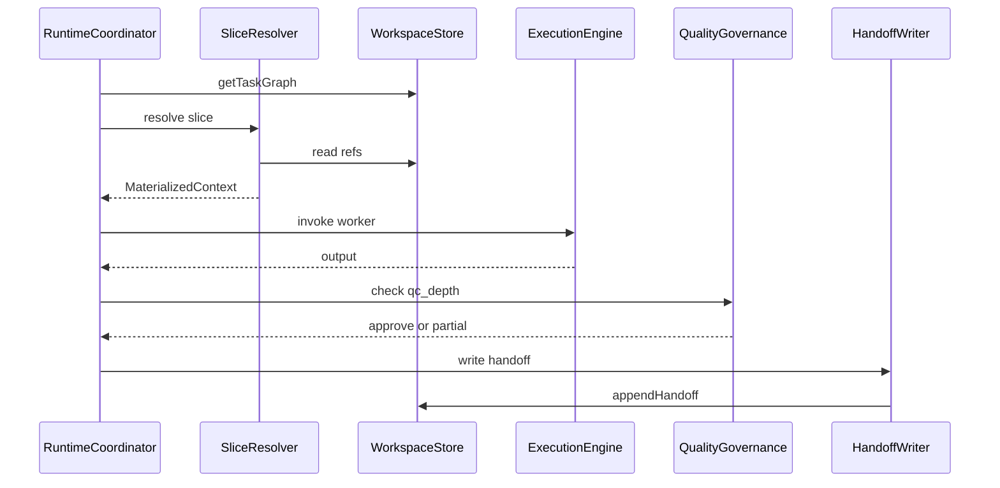

# ADR-001: Спецификация Workspace

> **Перевод для чтения.** Нормативный текст (EN): [../ADR-001-workspace-spec.md](../ADR-001-workspace-spec.md)

**Статус:** proposed  
**Дата:** 2026-07-09

## Контекст

**Workspace** — единый источник правды о mission (принцип P2). Worker'ы не читают весь Workspace; они получают **context slice** — адресный срез (P3). **Handoff** — обязательная операция записи при завершении Worker'а (P8).

MorphEnterprise — **автономная система координации**. **ExecutionEngine** (Cursor, raw API, CrewAI, LangGraph и т.д.) подключается как адаптер. Концепция v2 описывает *что* входит в Workspace и *как* связаны слои памяти; она не задаёт **протокол** хранения, разрешения срезов и персистентности handoff.

Этот ADR фиксирует протокол: логическая модель, профили Workspace от **SizingDecision** и три backend-agnostic компонента — **WorkspaceStore**, **SliceResolver**, **HandoffWriter**.

**Вне scope (отложено):**

- Технология хранения (БД, файлы, object store)
- Multi-tenant и UI
- Нормативное соответствие Phase 0 dogfooding этого репозитория (см. приложение)

## Решение

### 1. Логическая модель Workspace

У каждой **Mission** ровно один Workspace. Task graph — **поле** Workspace, не отдельный источник правды.

| Поле | Описание |
|------|----------|
| `mission` | Текущая mission и sub-missions |
| `requirements` | Требования, в т.ч. выход Discovery |
| `decisions` | ADR, выборы, обоснования |
| `artifacts` | Документы, схемы, ссылки на код |
| `task_graph` | DAG задач (часть Workspace) |
| `current_state` | Статус фазы lifecycle (enum: ADR-004) |
| `handoff_records` | Append-only записи завершённых Worker'ов |
| `knowledge_links` | Ссылки на внешний Knowledge |
| `competencies_active` | Компетенции, задействованные в mission |

Связи:

```
Mission 1──1 Workspace
Workspace 1──1 TaskGraph (поле task_graph)
TaskGraph *──* Tasks
Task 1──* Workers (последовательно во времени)
```

### 2. Четыре слоя памяти (логические)

Слои — **теги/представления** над содержимым Workspace, не отдельные физические хранилища:

| Слой | Содержание | Типичный источник в Workspace |
|------|------------|-------------------------------|
| **Knowledge** | Общие доки, стандарты, исследования | `knowledge_links` (внешние blob) |
| **CompetencyMemory** | Практики, прошлые решения, шаблоны по competency | Registry (ADR-002) + lesson в handoff |
| **ProjectMemory** | Почему приняли решение, уроки mission | `decisions` + lesson в handoffs |
| **WorkingContext** | Эфемерная текущая работа Worker'ов | В срезах; при handoff важное → ProjectMemory |

В срез попадают слои **выборочно** — никогда все сразу для одного Worker'а.

### 3. Профили Workspace (от SizingDecision)

Профиль описывает **эффективную форму** Workspace для mission. Вычисляется из полей [SizingDecision](../../concept/schemas/sizing-decision.yaml) — не из меток solo/small/full. Нормативное поле `workspace_profile` в schema — в ADR-003.

| Профиль | Правило | Обязательные / активные поля |
|---------|---------|------------------------------|
| **minimal** | `executor_count = 1` И `planner_depth = 0` | `mission`, `current_state`, working context, `handoff_records` по завершении; полный `task_graph` опционален (допустима одна задача) |
| **standard** | `planner_depth >= 1` ИЛИ (`executor_count > 1` И `discovery_required = false`) | поля minimal + `task_graph`, `requirements`; `decisions` по необходимости |
| **full** | `discovery_required = true` ИЛИ `qc_depth = full` ИЛИ mission high-risk | Все поля; полный `task_graph`; Discovery в `requirements`; несколько `handoff_records` |

**Краевые случаи:**

| Случай | Правило |
|--------|---------|
| `planner_depth = 0`, `executor_count > 1` | **minimal + parallelism**; `task_graph` опционален |
| `discovery_required = true` | Профиль → **full**; `requirements` доступны на запись |
| Handoff `status: failed` | Worker завершён с ошибкой; mission может **resize** (P6) |
| Knowledge blob | WorkspaceStore хранит **только refs**; blob снаружи |

Director/SizingDecision выбирает профиль. **RuntimeCoordinator** не расширяет slice Worker'а без resize (новый SizingDecision или `authorized_by: sizing_decision`).

Соответствие концепции v2: **minimal** ≈ «минимальный Workspace»; **full** ≈ «полная организация»; **standard** — промежуточный случай (планирование или параллелизм без полного Discovery).

### 4. Компоненты протокола

Три компонента задают протокол Workspace. В реализации могут жить в одном модуле; контракты разделены.

#### 4.1 WorkspaceStore

Backend-agnostic API чтения/записи. Формат хранения не фиксируется.

**Чтение:**

- `getMission(mission_id)`
- `getTaskGraph(mission_id)`
- `getState(mission_id)`
- `getHandoffs(mission_id, filters?)`
- `resolveRef(mission_id, ref)` — артефакты, knowledge links

**Запись (по роли):**

| Операция | Роль | Примечание |
|----------|------|------------|
| `putTaskGraph` | Planner | Создание/обновление DAG |
| `putRequirements` | Discovery, Planner | Требования и выход Discovery |
| `putState` | RuntimeCoordinator | Обновление lifecycle; enum в ADR-004 |
| `appendHandoff` | Только HandoffWriter | Append-only (P8); все Worker'ы, включая Critic |
| `putFormalDecision` | Director | Формальные ADR вне handoff Worker'а (опционально) |
| `setCompetenciesActive` | Director, RuntimeCoordinator | При sizing / resize |

Решения, уроки и артефакты от Worker'ов — в основном через `records` в handoff ([handoff-record.yaml](../../concept/schemas/handoff-record.yaml)). Не дублировать одно решение и в handoff, и в `putFormalDecision`.

Knowledge blob — **внешние**; store хранит только ссылки.

#### 4.2 HandoffWriter

Фасад над `WorkspaceStore.appendHandoff` — не второй append API.

1. Валидация по [handoff-record.yaml](../../concept/schemas/handoff-record.yaml) (мин. одна запись; типы: decision, lesson, artifact).
2. **После QualityGovernance** — `status: completed` только при approve QC; иначе `partial` или `failed` по schema.
3. При необходимости — `qc_result`.
4. Вызов `WorkspaceStore.appendHandoff`.
5. Worker **не завершён**, пока handoff не успешен (P8).

#### 4.3 SliceResolver

Материализует [WorkspaceContextSlice](../../concept/schemas/workspace-slice.yaml) в непрозрачный **MaterializedContext** для ExecutionEngine (текст, JSON и т.д. — формат здесь не фиксируется).

**Вход:** `mission_id`, `task_id`, `worker_id`, `role` (worker | planner | director | critic | runtime_coordinator), `SizingDecision`, опционально spec среза, `competency_ids`, **чтение Registry** для competency memory (зависимость ADR-002).

**Выход:** `MaterializedContext` с ограничением `max_tokens`, если задано.

**Правила:**

- Разрешать `includes` / `excludes` по spec и роли.
- Уважать `authorized_by`: расширение среза только при `sizing_decision` или явном resize — RuntimeCoordinator сам не расширяет slice Worker'а (P3).
- Матрица доступа по ролям:

| Роль | Может читать |
|------|--------------|
| Worker | Slice своей competency + task |
| Planner | Summary mission + task graph + requirements |
| Director | Summary mission + risk + state (не полные тела артефактов) |
| RuntimeCoordinator | Task graph + state; не расширяет slice без resize |
| Critic | Slice исполнителя + output + success_criteria |

### 5. Взаимодействие с RuntimeCoordinator

Краткая последовательность (детали в ADR-005):



**ExecutionEngine не делает:** sizing, выбор компетенций, запись handoff, прямую запись в Workspace.

**Границы ADR:**

| Тема | ADR |
|------|-----|
| API Registry, источники competency memory | ADR-002 |
| Алгоритм sizing Director | ADR-003 |
| Enum lifecycle для `current_state` | ADR-004 |
| State machine RC, retry, resize | ADR-005 |

### Приложение A — Phase 0 dogfooding (не нормативно)

Этот репозиторий применяет принципы MorphEnterprise только в Phase 0. Таблица ниже **не** описывает целевую систему.

| Объект v2 | Этот репозиторий (Phase 0) |
|-----------|----------------------------|
| Workspace | `docs/` + git |
| Director | Человек |
| ExecutionEngine | Cursor |
| Handoff | `docs/JOURNAL.md` + git commits (неформально) |
| WorkspaceStore / SliceResolver / HandoffWriter | Не реализованы — ручной процесс |

## Последствия

**Плюсы:**

- Не привязан к стеку; любой язык в Phase 2+
- Память по задаче формализована (профили + slice)
- Чёткая граница ExecutionEngine ↔ протокол Workspace

**Минусы / отложено:**

- Нет выбора storage backend (отдельное решение в Phase 2)
- Сложность SliceResolver — в коде Phase 2
- RU-главы концепции 01–10 остаются детальным источником до полного EN-перевода

**Дальше:**

- ADR-002 — CompetencyRegistry
- ADR-003 — Director / SizingDecision
- ADR-004 — Lifecycle state machine
- ADR-005 — Runtime coordination
- Phase 2 — первая реализация `StorageBackend` (отдельный ADR)

## Ссылки

- Концепция EN: [00-overview.md](../../concept/en/00-overview.md)
- Концепция RU: [05-workspace.md](../../concept/ru/05-workspace.md)
- Schemas: [workspace-slice.yaml](../../concept/schemas/workspace-slice.yaml), [handoff-record.yaml](../../concept/schemas/handoff-record.yaml), [sizing-decision.yaml](../../concept/schemas/sizing-decision.yaml), [mission.yaml](../../concept/schemas/mission.yaml)
- Execution layer: [08-execution-layer.md](../../concept/ru/08-execution-layer.md)
- GitHub Issue: [#2](https://github.com/devmrbouh-hub/MorphEnterprise/issues/2)
- Канон (EN): [ADR-001-workspace-spec.md](../ADR-001-workspace-spec.md)
